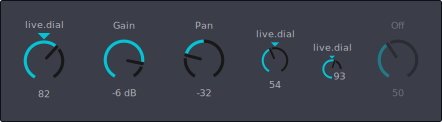

# ableton-web-components

[](https://www.npmjs.com/package/ableton-web-components)
[](https://ben-juodvalkis.github.io/ableton-web-components/)
[](LICENSE)

High-fidelity, framework-agnostic **web components that look and behave like native Ableton Live controls** — built for the new [Ableton Extensions SDK](https://ableton.github.io/extensions-sdk/) webviews and for any Live-themed web UI.

Think of this as the web equivalent of Max's `live.dial`, `live.slider`, and friends: a kit of pixel-accurate, automatable, theme-aware controls so the community can build extensions that feel like they belong inside Live.

<p align="center">
  
</p>

**▶ [Try the live playground](https://ben-juodvalkis.github.io/ableton-web-components/)** — drag a dial, tweak every attribute, and switch between the stock Live themes to watch the controls re-skin live.

> **Status:** early scaffold. We're **initially shipping `<able-dial>`** (the Live dial) as the first proof component, with more controls on the way — see the [Roadmap](#roadmap). APIs will change.

## Why this exists

On 2 June 2026 Ableton shipped the **Extensions SDK** (Live 12.4.5 beta). Extensions render their UI in a **webview** using standard HTML/CSS/JS — but Ableton ships **no UI components**. Every extension author currently hand-rolls their own knobs and sliders, so extensions look like generic web pages instead of native Live devices.

This project fills that gap with controls that:

- **Look like Live** — geometry and colors recreated from scratch (see [Fidelity & legal](#fidelity--legal)).
- **Match the user's theme** — CSS custom properties mirror Live's `.ask` theme variable names, so components can auto-adapt to the active skin.
- **Work in any framework** — they're standard Custom Elements (built with [Lit](https://lit.dev)). Drop them into React, Vue, Svelte, or plain HTML.

## Install

```bash
npm install ableton-web-components
```

```js
import 'ableton-web-components';        // registers all <able-*> elements
import 'ableton-web-components/theme.css'; // default Live-dark theme tokens
```

Or via CDN for zero-build extensions:

```html
<link rel="stylesheet" href="https://unpkg.com/ableton-web-components/dist/ableton-web-components.css" />
<script type="module" src="https://unpkg.com/ableton-web-components"></script>
```

## Usage

> Prefer to poke at it first? The **[interactive playground](https://ben-juodvalkis.github.io/ableton-web-components/)** lets you drag a dial and toggle every attribute live, with a copy-pasteable snippet.

```html
<able-dial value="64" min="0" max="127" label="Freq"></able-dial>
<able-dial value="-6" min="-70" max="6" default="0" unit="dB" label="Gain"></able-dial>

<!-- optional indicator triangle (live.dial's "Show Triangle") -->
<able-dial value="82" label="live.dial" triangle></able-dial>

<!-- bipolar: arc fills from center, for pan / detune -->
<able-dial value="-32" min="-64" max="63" default="0" label="Pan" bipolar></able-dial>

<!-- hide the name and/or value text -->
<able-dial value="64" label="Freq" hide-name hide-value></able-dial>

<!-- compact form factors — smaller circle, same geometry -->
<able-dial value="54" label="live.dial" type="vertical" triangle></able-dial>
<able-dial value="93" label="live.dial" type="tiny"></able-dial> <!-- value nests in the ring gap -->
```

```js
const dial = document.querySelector('able-dial');
dial.addEventListener('input', (e) => console.log(e.detail.value)); // while dragging
dial.addEventListener('change', (e) => console.log(e.detail.value)); // on release
```

### `<able-dial>`

| Attribute     | Type    | Default   | Notes                                                              |
| ------------- | ------- | --------- | ----------------------------------------------------------------- |
| `type`        | string  | `large`   | Form factor: `large`, `vertical` (compact), or `tiny` (smallest; value nests into the ring gap). Same geometry |
| `value`       | number  | `0`       | Current value                                                     |
| `min` / `max` | number  | `0`/`127` | Range                                                             |
| `step`        | number  | `0`       | `0` = continuous                                                 |
| `default`     | number  | `0`       | Value restored on double-click (set to the center for `bipolar`) |
| `decimals`    | number  | `2`       | Display rounding                                                 |
| `label`       | string  | `''`      | Name shown above the dial (live.dial's "Short Name")             |
| `unit`        | string  | `''`      | Appended to displayed values (e.g. `dB`, `%`)                   |
| `accent`      | string  | `''`      | Arc / triangle color (any CSS color); defaults to live.dial cyan |
| `triangle`    | boolean | `false`   | Show the accent indicator triangle above the dial                |
| `bipolar`     | boolean | `false`   | Fill the arc from the 12-o'clock center outward (pan, detune)    |
| `hide-name`   | boolean | `false`   | Collapse the name above the dial (shown by default)              |
| `hide-value`  | boolean | `false`   | Collapse the value below the dial (shown by default)             |
| `disabled`    | boolean | `false`   |                                                                  |

The **name** sits above the dial and the **value** sits below, mirroring live.dial; both are shown by default and collapse independently via `hide-name` / `hide-value`.

Interaction follows Live conventions: **vertical drag** to change, **Shift+drag** for fine control, **double-click** to reset, full **keyboard** support (arrows / Page / Home / End), and `role="slider"` ARIA.

Both events carry `{ value }` in `detail`: `input` fires continuously while dragging, `change` once on release / commit.

## Roadmap

The kit launches with the dial and grows toward a full set of Live-style controls. Priorities (subject to change):

**Available today**

- ✅ **`<able-dial>`** — the Live dial (`large` / `vertical` / `tiny` form factors, bipolar, triangle indicator)

**Phase 1 — core controls**

- ⬜ `<able-slider>` — horizontal & vertical sliders
- ⬜ `<able-toggle>` / `<able-button>` — toggles and momentary buttons
- ⬜ `<able-number>` — numeric value box
- ⬜ `<able-dropdown>` — enum / chooser dropdown

**Phase 2 — compound controls**

- ⬜ `<able-xy>` — XY pad
- ⬜ `<able-range>` — range (dual-handle) slider
- ⬜ `<able-meter>` — meter / VU
- ⬜ `<able-envelope>` — breakpoint / envelope editor
- ⬜ `<able-grid>` — step-sequencer grid

Want one of these sooner, or have another control in mind? Open an issue or see [CONTRIBUTING.md](CONTRIBUTING.md) to help build it.

## Theming

All visuals are driven by CSS custom properties in [`src/theme.css`](src/theme.css), named to mirror Live's `.ask` keys (e.g. `--able-control-foreground`, `--able-control-filled`). Override them on `:root` or any container to retheme, or to pipe in the host's active Live theme at runtime from an Extension.

Because the tokens map 1:1 to Live's `.ask` color keys, dropping in a different skin is just a matter of setting those variables. The **[playground](https://ben-juodvalkis.github.io/ableton-web-components/)** demonstrates this with all of Live 12's stock themes — pick one from the menu and every control re-skins instantly. Those palettes are generated from the plain-text `.ask` files by [`scripts/build-themes.mjs`](scripts/build-themes.mjs) into a small JSON of color values only (no Ableton assets are redistributed — see [Fidelity & legal](#fidelity--legal)).

## Develop

```bash
npm install
npm run dev         # quick demo page at http://localhost:5173
npm run dev:demo    # the GitHub Pages playground locally
npm run build:themes # regenerate themes.json from a local Live install (dev-only)
npm run storybook   # component explorer
npm run build       # library -> dist/
npm run typecheck
```

Publishing to npm and deploying the demo site are documented in [RELEASING.md](RELEASING.md).

## Fidelity & legal

This project **does not redistribute any Ableton or Cycling '74 assets.** All control geometry is original SVG/CSS, recreated by measuring screenshots and sampling colors from publicly editable `.ask` theme files. See [docs/FIDELITY.md](docs/FIDELITY.md) for the recreation process and [PRIOR-ART.md](PRIOR-ART.md) for related projects and how this differs.

Not affiliated with or endorsed by Ableton AG.

## License

[MIT](LICENSE)
